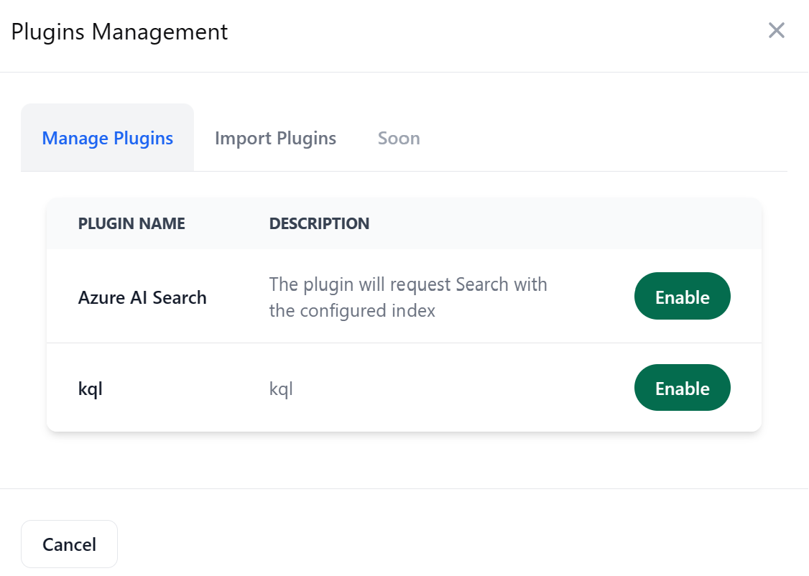

# Use cases (Graphics)


## User manage a plugin
You have the possiblity to enable one or more plugins using this interface : 


If you ever you want to import a new plugin, you can do it with this interface : 


How it works behind : 


## User add index
You also have the possibility to create new indexes in your Azure Search : 


you can also choose one index to query : 


How it works behind


## User query

when you ask a question this is how it works behind :


## Available Custom Plugin : Azure Search Plugin

When the user tries to ask a question, the planner is finding the right action to take (the plugin), then it sends a request to it.

If the Plugin is our Azure Search Plugin, it will rewrite the query to get a clear intention. If we send "I want the process of the onboarding", the real intention will be "The user is trying to get onboarded and the user is looking for a process of the onboarding", this is the new query which is sent to get the context from Azure Search, 
then the context + The query + the history are sent to a semantic function "Response", to rewrite the response and transform it.

# known limitations

# How to run it ?
Fill the environment variables;

In front end run : 
```
npx vite build
```` 

In backend :
- Install the requirements.txt
```
pip install requirements.txt
```
- run the app :
```
python app.py
```

# Chatbot with Context and Memory, using Semantic Kernel - bot.py Class

This Python class represents a chatbot with context and memory, leveraging the Semantic Kernel for interaction with Azure OpenAI's Large Language Model (LLM).

## Imports

```python
from semantic_kernel import Kernel, ContextVariables
from semantic_kernel.planning import ActionPlanner
```

## Methods
```python
class bot:
    """Create a chatbot with Azure OPENAI LLM."""
    
    kernel = None
    variables = None

    def __init__(self, kernel: Kernel, variables: ContextVariables):
        self.kernel = kernel
        self.variables = variables

    async def retrieverAugmentedGeneration(self, index_name: str, query: str, chat_history: str) -> str:
        """
        Asks the LLM to answer the user's query with the context provided.
        The index_name may be empty if we are not using Azure Search.
        """
        # Method implementation...

    async def ask(self, index_name: str, query: str, chat_history: str) -> str:
        """
        Send the request to openAI.
        """
        # Method implementation...
```

### retrieverAugmentedGeneration
This method generates responses using Azure OpenAI LLM. It takes three parameters - index_name, query, and chat_history. It constructs a user template, sets various variables in the context, prints the kernel's skills, creates a plan using an ActionPlanner, invokes the plan, updates the chat history, and returns the result.

### ask
This higher-level method calls retrieverAugmentedGeneration and prints the question and response.

### Usage of Semantic Kernel
The Kernel instance (self.kernel) is assumed to have a skills attribute, which is printed during the execution of retrieverAugmentedGeneration. The skills likely contain information or capabilities that the chatbot can utilize.

### Interaction with Azure OpenAI LLM
The chatbot interacts with Azure OpenAI LLM to generate responses asynchronously using the retrieverAugmentedGeneration method. The response is then printed and returned.

# Manage Plugins
## class_instanciation method
This method is responsible for dynamically creating an instance of a class based on the provided module name and class name.
It uses importlib.import_module to dynamically import the specified module.
If the module is successfully imported, it attempts to get the class using getattr.
If the class is found, an instance of the class is created and returned.
## updateKernel method
This method updates the kernel with various components.

s
It creates an instance of sk.Kernel() and adds a chat service (AzureChatCompletion) to it.


It initializes a ContextVariables instance (variables) and sets the "chat_history" attribute to an empty string.
It iterates over the provided plugins dictionary, where each entry is expected to be a mapping of class name to module name.
For each plugin, it dynamically instantiates the class using the class_instanciation method and imports the skill into the kernel using kernel.import_skill.


It then imports semantic skills from a specified directory using kernel.import_semantic_skill_from_directory.
Finally, it prints the JSON representation of the kernel's skill collection and returns the updated kernel and variables.


Note: The provided code assumes that the classes specified in the plugins and the directory contain appropriate methods and attributes to function as skills in the semantic kernel.

Note 2 : This is used as for now, there is no method to handle the kernel exclusion of the plugins in python, this function is temporary waiting for updates.

# Manage Indexes (if needed)

## __init__ method:
Initializes the memoryManagerStore class.
Loads environment variables related to Azure services.
Creates an instance of AzureCognitiveSearchMemoryStore to manage memory storage.
## load_and_split_documents method:
Loads and splits documents from the specified directory.
Uses DirectoryLoader to load documents and CharacterTextSplitter to split them into chunks.
## initialize method:
Initializes the kernel and adds the OpenAI text embedding service.
Registers the Azure Cognitive Search Memory Store in the kernel.
Saves the loaded and split documents into the memory store.
## delete method:
Deletes the specified index from the memory store.
## list_indexes method:
Lists the indexes available in the Azure Cognitive Search service.
Uses the Azure SDK to interact with the search service and retrieve the list of indexes.